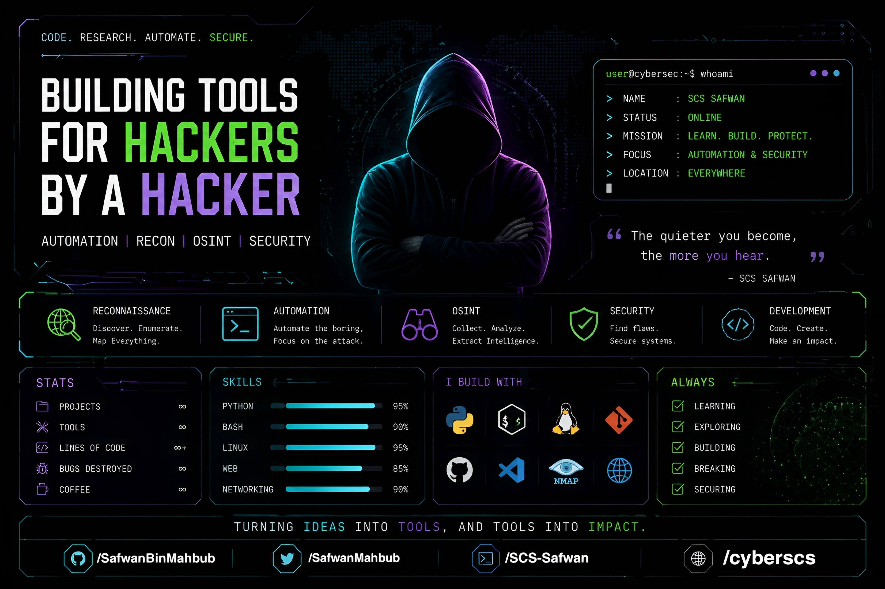

# Hi, I'm SCS Safwan 👋

Cyber Security Enthusiast | Tool Developer

## About Me
I build efficient automation and reconnaissance workflows focused on real-world security use cases.  
Driven by curiosity, I experiment, break, learn, and improve systems continuously.

## Focus
- Automation & Workflow Optimization  
- Reconnaissance & Intelligence Gathering  
- OSINT & Data Analysis  
- Practical Cybersecurity

## Skills
- Python  
- Termux & Linux  
- Networking Basics  
- Scripting & Automation  

## Mindset
- Learn fast, adapt faster  
- Build, break, secure  
- Stay low, think deep  

## Goals
- Create impactful security tools  
- Master offensive & defensive techniques  
- Contribute to the cybersecurity community  

---

> “The quieter you become, the more you hear.”
<!--
**SafwanBinMahbub/SafwanBinMahbub** is a ✨ _special_ ✨ repository because its `README.md` (this file) appears on your GitHub profile.

Here are some ideas to get you started:

- 🔭 I’m currently working on ...
- 🌱 I’m currently learning ...
- 👯 I’m looking to collaborate on ...
- 🤔 I’m looking for help with ...
- 💬 Ask me about ...
- 📫 How to reach me: ...
- 😄 Pronouns: ...
- ⚡ Fun fact: ...
-->
